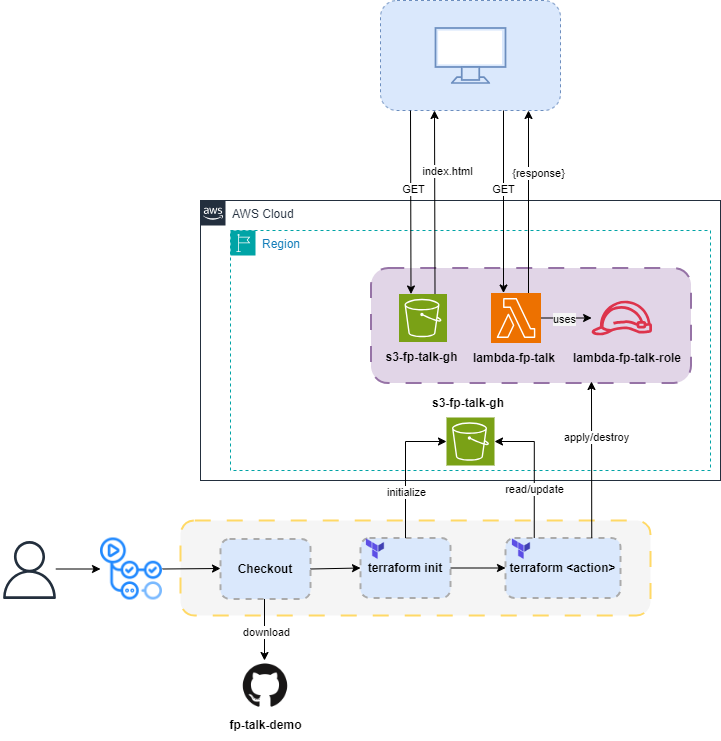

# FP Talk Demo 

## Description

Demonstration repository that uses Github Actions and Terraform to deploy a S3 bucket website and a Node.Js lambda with public url.



## How to use

* Fork this repository
* Create variables
    * BUCKET_NAME
    * LAMBDA_NAME
* Create secrets
    * AWS_ACCESS_KEY_ID
    * AWS_SECRET_ACCESS_KEY
* Create a S3 bucket for terraform tfstate in eu-west-region
* Update the file version.tf with the bucket name created in previous step
```bash
  backend "s3" {
    bucket = "s3-fp-talk-tf-backend" #Replace with your bucket name
    key    = "terraform"
    region = "eu-west-3"
  }
```