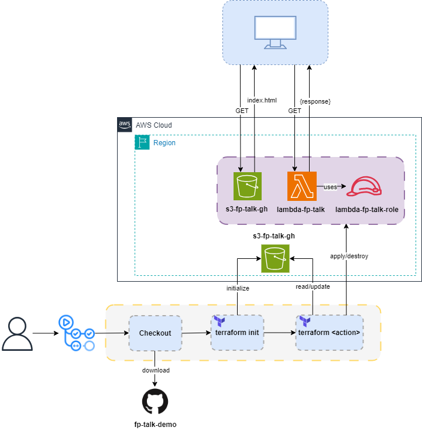

# FP Talk Demo 

## Description

Demonstration repository that uses Github Actions and Terraform to deploy a S3 bucket website and a Node.Js lambda with public url.



## How to use

### 1. Fork this repository

Click the **Fork** button in the top right of this repository to create your own copy. This allows you to make changes and run the GitHub Actions workflows on your own AWS account.

### 2. Configure AWS Authentication with OIDC

This repository uses OpenID Connect (OIDC) for secure AWS authentication, eliminating the need to store AWS credentials as secrets.

#### Steps to configure OIDC:

1. **Create an OIDC Identity Provider in AWS:**
   - Go to AWS IAM console
   - Navigate to `Identity Providers`
   - Click `Create Provider`
   - Select **OpenID Connect**
   - Provider URL: `https://token.actions.githubusercontent.com`
   - Audience: `sts.amazonaws.com`
   - Click `Create Provider`

2. **Create an IAM Role for GitHub Actions:**
   - Go to IAM console → Roles → Create role
   - Select `Web identity` as trusted entity type
   - Identity provider: Select the OIDC provider created above
   - Audience: `sts.amazonaws.com`
   - Click `Next`
   - Attach the necessary permissions (e.g., `AmazonS3FullAccess`, `AWSLambdaFullAccess`, `AmazonEC2FullAccess`, etc.)
   - Set role name: e.g., `github-actions-role`
   - Note the Role ARN (e.g., `arn:aws:iam::YOUR-ACCOUNT-ID:role/github-actions-role`)

3. **Add the Role ARN to GitHub Secrets:**
   - Go to your forked repository → Settings → Secrets and variables → Actions
   - Create a new secret named `AWS_ROLE`
   - Paste your Role ARN as the value
   - Click `Add secret`

### 3. Configure GitHub Variables and Secrets

Create the following in your repository (Settings → Secrets and variables → Actions):

**Variables:**
- `BUCKET_NAME`: Name of your S3 bucket for the website
- `LAMBDA_NAME`: Name of your Lambda function

**Secrets:**
- `AWS_ROLE`: Your IAM Role ARN for OIDC authentication (created in step 2)

### 4. Prepare the Terraform Backend

Create a S3 bucket in eu-west-1 to store the Terraform state file:

```bash
aws s3api create-bucket \
  --bucket s3-fp-talk-tf-backend \
  --region eu-west-1 \
  --create-bucket-configuration LocationConstraint=eu-west-1
```

Update the `versions.tf` file with your bucket name:

```hcl
backend "s3" {
  bucket = "s3-fp-talk-tf-backend"  # Replace with your bucket name
  key    = "terraform"
  region = "eu-west-1"
}
```

### 5. Run the Workflow

- Go to Actions tab in your repository
- Select the **Terraform** workflow
- Click **Run workflow**
- Choose the Terraform action: `apply` or `destroy`
- Monitor the workflow execution